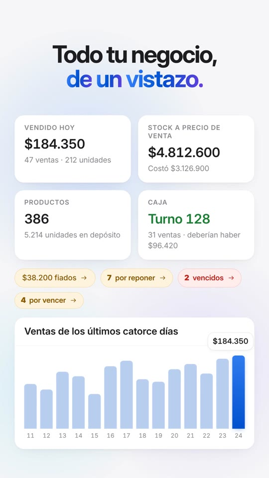

# El video de Visual App

<a href="visual-app.mp4"></a>

**[`visual-app.mp4`](visual-app.mp4)** — 45 segundos, vertical 9:16 (1080 × 1920),
60 cuadros por segundo, con música. Listo para Reels, TikTok, Shorts o estados
de WhatsApp.

| Segundos | Qué se ve |
| --- | --- |
| 0 – 4 | La marca se dibuja trazo a trazo sobre negro y la cámara entra por el azul |
| 4 – 8 | *Stock. Caja. Ventas.* — y "Todo en una sola app" |
| 8 – 14 | El Panel: la ventana de Windows se endereza y la cámara la atraviesa hasta los números |
| 14 – 22 | La caja: lector de códigos, búsqueda, venta por peso, cobro con vuelto, aviso de venta y comprobante |
| 22 – 27 | Productos: elegir varios, subir precios un 10 % de una vez, y cada movimiento de stock |
| 27 – 33 | Fiado, proveedores, vencimientos, etiquetas, recuento, usuarios, copias y actualizaciones |
| 33 – 37 | Informes: vendido, costo, margen, resultado y lo que más se vendió |
| 37 – 41 | El celular por el wifi del local, leyendo un código con la cámara |
| 41 – 45 | Cierre con la marca |

Las pantallas son las de la aplicación: los mismos colores, sombras, íconos y
textos de `tailwind.config.ts`, `components/` y `app/`. Los números son de un
almacén inventado.

## Cómo está hecho

No es un programa de edición: es una página web que se dibuja sola.

```
index.html     el escenario de 1080 × 1920 y los estilos (los tokens de la aplicación)
motor.js       curvas, resortes, contadores de rodillo: tiempo → posición
escenas.js     las nueve escenas y sus transiciones
musica.py      la banda sonora, sintetizada nota por nota
render.mjs     abre la página en Chromium, saca cada cuadro y arma el MP4
fuentes/       Inter (licencia OFL), porque el video no puede usar la letra del sistema
```

Todo lo que se mueve es una función del tiempo: `window.__dibujar(12.5)` pone
cada elemento donde tiene que estar en el segundo 12,5. No hay transiciones de
CSS ni relojes, así que el renderizador puede sacar los cuadros en cualquier
orden y en paralelo, y el video sale idéntico en cualquier máquina.

La música tampoco usa samples: el bombo, los acordes, el pitido del lector y el
"ding" del cobro salen de fórmulas (`musica.py`). Se puede publicar sin pedirle
permiso a nadie.

## Verlo y cambiarlo

Hace falta Node 22, Python 3 con `numpy` y `scipy`, y `ffmpeg`.

```bash
cd video
npm install
npm run vista        # http://127.0.0.1:5178 — espacio pausa, flechas cuadro a cuadro
```

Con la vista previa abierta, `?t=17.9` en la dirección congela ese segundo.

Para volver a armar el video:

```bash
npm run musica       # musica.wav
npm run render       # visual-app.mp4 (unos dos minutos con cuatro núcleos)
node render.mjs --cuadros 9.5,18.6,30   # solo esas fotos, en .muestras/
```

`render.mjs` busca Chromium donde lo deja Playwright; si está en otro lado,
`CHROMIUM=/ruta/al/chrome`. Lo mismo con `FFMPEG=/ruta/a/ffmpeg`.

Los tiempos de cada escena están al principio de su bloque en `escenas.js`, y
los efectos de sonido en `musica.py` usan esos mismos segundos: si se corre
algo de lugar en una, hay que correrlo en la otra.
